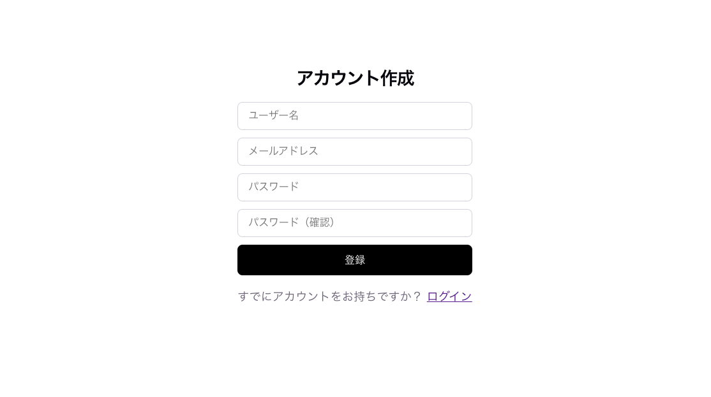
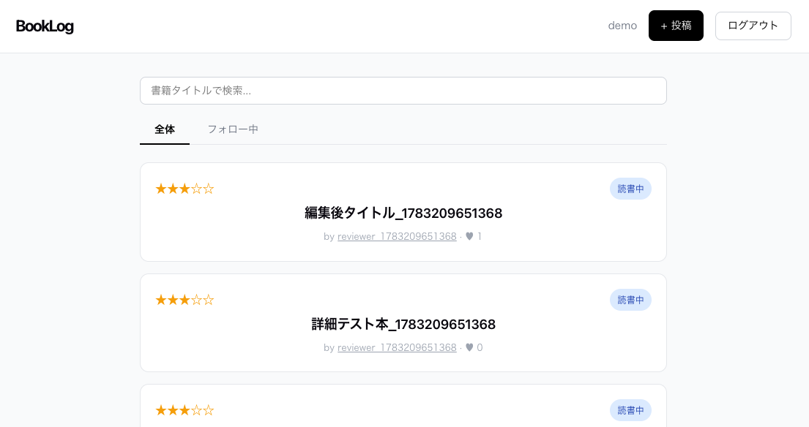
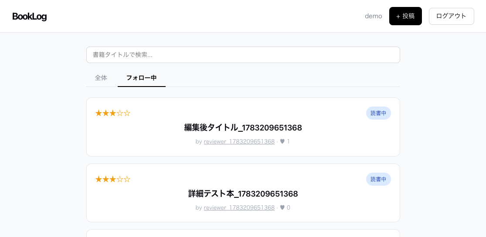
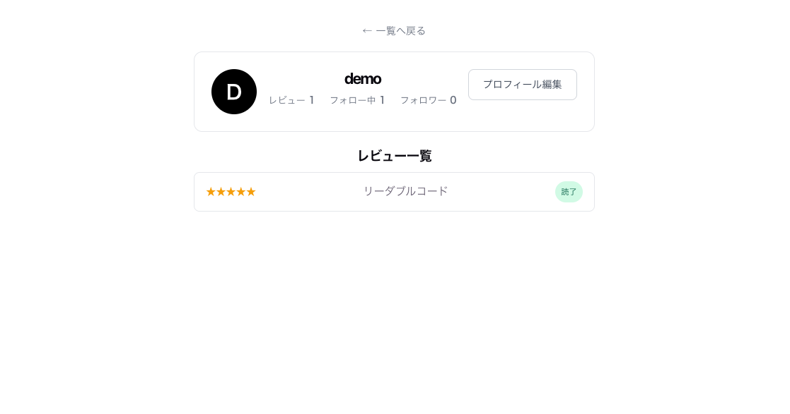

# BookLog

読んだ本の記録・共有ができる読書ログアプリです。Ruby on Rails（API）+ React / TypeScript で構築したフルスタック Web アプリケーションです。

## 本番 URL

**https://d27xeybd2foudv.cloudfront.net**

### ゲストアカウント

| 項目 | 値 |
|------|-----|
| メールアドレス | `guest@booklog.example.com` |
| パスワード | `guestpass123` |

ゲストアカウントでログインするとサンプルレビュー・フォロー・いいね・コメントが確認できます。

---

## アプリ概要

読んだ本の感想・評価を投稿し、他のユーザーと共有できる読書記録サービスです。

### 開発背景

読んだ本の感想をメモに残していても、後から「あの本どう思ったか」を振り返るのが難しく、読書の記録が続かないという課題がありました。また、自分と似た読書傾向を持つ人のレビューを参考にしたいという思いもありました。この課題を解決するために、読書記録の投稿・共有・フォロー機能を備えた Web アプリを開発しました。

### 解決できること

- **読書記録の一元管理**：書籍名・評価・感想・読了ステータスをまとめて記録できる
- **コミュニティ機能**：他ユーザーをフォローしてそのレビューをフィードで確認できる
- **インタラクション**：いいね・コメントで感想を共有し合える
- **表紙画像の添付**：書籍の表紙画像をアップロードして視覚的に管理できる

---

## 画面構成

### ① ログイン画面


メールアドレスとパスワードでログイン。アカウント未登録の場合は新規登録ページへ遷移できます。

---

### ② 新規登録画面



ユーザー名・メールアドレス・パスワードを入力してアカウントを作成します。

---

### ③ ホーム画面（全体フィード）



全ユーザーの最新レビューを一覧表示します。評価（星）・ステータス（読書中／読了）・いいね数を確認できます。

---

### ④ ホーム画面（フォロー中フィード）



フォロー中ユーザーのレビューのみ絞り込んで表示します。タブ切り替えで全体フィードと行き来できます。

---

### ⑤ レビュー投稿画面


書籍名・感想・星評価・読書ステータス・表紙画像をフォームから投稿できます。

---

### ⑥ レビュー詳細画面


レビューの詳細情報を表示します。いいねボタン・コメント投稿フォームを備えます。投稿者本人には編集・削除ボタンが表示されます。

---

### ⑦ プロフィール編集画面



ユーザー名・自己紹介文を編集できます。フォローボタンも表示されます。

---

## 実装済み機能

| 機能 | 内容 |
|------|------|
| 認証 | 新規登録・ログイン・ログアウト（JWT） |
| レビュー | 投稿・一覧・詳細・編集・削除 |
| 写真添付 | 書籍の表紙画像アップロード（Active Storage / S3） |
| いいね | レビューへのいいね・取り消し |
| コメント | レビューへのコメント投稿・削除 |
| フォロー | ユーザーフォロー・アンフォロー |
| フォローフィード | フォロー中ユーザーのレビューのみ表示 |
| プロフィール | ユーザー名・自己紹介の編集 |

---

## 技術スタック

### バックエンド

| 役割 | 技術 | バージョン | 選定理由 |
|------|------|-----------|---------|
| 言語 | Ruby | 3.3.2 | 可読性が高く Rails との親和性が優れている |
| フレームワーク | Ruby on Rails | 8.1.3 | API モードで軽量に構築・設定より規約で開発速度が上がる |
| 認証 | devise + devise-jwt | 5.0.4 / 0.13.0 | JWT によるステートレス認証・フロントエンドとの分離に適している |
| DB | PostgreSQL | 16 | JSON 対応・本番 RDS との互換性 |
| テスト | RSpec + FactoryBot | 7.x | 可読性の高い DSL でリクエストスペックを網羅 |
| 静的解析 | RuboCop (rails-omakase + rspec) | — | Rails 公式推奨スタイルに準拠 |
| ファイルストレージ | Active Storage + AWS S3 | — | Rails 標準機能で画像管理・本番は S3 に保存 |

### フロントエンド

| 役割 | 技術 | バージョン | 選定理由 |
|------|------|-----------|---------|
| 言語 | TypeScript | 6.0 | 型安全性・開発時のバグ検出 |
| フレームワーク | React | 19 | コンポーネント設計・SPA として快適な操作感 |
| ビルドツール | Vite | 5 | 高速な HMR・軽量な設定 |
| ルーティング | React Router | 7 | SPA のページ遷移管理 |
| HTTP クライアント | axios | 1.x | インターセプターで JWT を自動付与 |
| ユニットテスト | Vitest + React Testing Library | 4.x | Vite と親和性が高く高速・ユーザー操作に近いテスト |
| E2E テスト | Playwright | 1.x | 実ブラウザでの操作検証・CI との統合が容易 |

### インフラ

| 役割 | 技術 | 選定理由 |
|------|------|---------|
| コンテナ実行 | AWS ECS Fargate | サーバー管理不要でスケーラブルなコンテナ実行環境 |
| コンテナレジストリ | AWS ECR | ECS との親和性・イメージの安全な管理 |
| データベース | AWS RDS (PostgreSQL 16) | マネージドサービスで運用負担を軽減 |
| ロードバランサー | AWS ALB | HTTPS 対応・ヘルスチェック・ECS との統合 |
| フロントエンド配信 | AWS S3 + CloudFront | 静的ファイルを CDN で高速配信 |
| IaC | Terraform | インフラをコードで管理・再現性の担保 |
| CI/CD | GitHub Actions | バックエンド RSpec / フロントエンド Vitest / E2E の 3 ワークフロー |

---

## インフラ構成

詳細は [docs/architecture.md](docs/architecture.md) を参照してください。

---

## ER 図

詳細は [docs/er_diagram.md](docs/er_diagram.md) を参照してください。

---

## API ドキュメント

詳細は [docs/api.md](docs/api.md) を参照してください。

---

## テスト

| 種別 | ツール | テスト数 | 結果 |
|------|--------|---------|------|
| バックエンド | RSpec | 55 | 全件パス |
| フロントエンド | Vitest + RTL | 14 | 全件パス |
| E2E | Playwright | 10 | 全件パス |
| 静的解析 | RuboCop | 52 ファイル | 0 violations |

---

## ローカル開発環境のセットアップ

### 必要な環境

- Ruby 3.3.2
- Node.js 22.x
- Docker / Docker Compose

### 手順

```bash
# リポジトリをクローン
git clone https://github.com/KAT-brave/BookLog.git
cd BookLog

# データベース起動 (PostgreSQL 16 on port 5433)
docker compose up -d db

# バックエンド
cd backend
bundle install
rails db:create db:migrate db:seed
rails server  # http://localhost:3000

# フロントエンド (別ターミナル)
cd frontend
npm install
npm run dev  # http://localhost:5173
```

### テスト実行

```bash
# バックエンド (RSpec)
cd backend && bundle exec rspec

# フロントエンド (Vitest)
cd frontend && npm test

# E2E (Playwright) ※ サーバーを起動した状態で実行
cd frontend && npm run e2e

# RuboCop
cd backend && bundle exec rubocop
```
