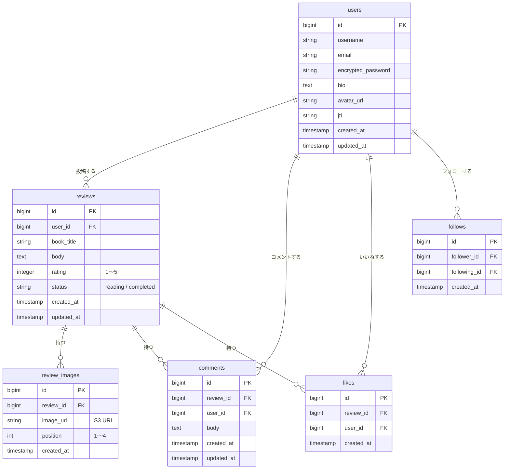

# BookLog

読書記録アプリ（学習目的）

---

## アプリ概要

書籍のレビュー投稿、いいね、コメント、フォローができる読書記録Webアプリです。

### 開発背景

読書習慣を記録・共有するアプリは日常的に利用する機会が多く、「どのような仕組みで動いているのか」を実際に手を動かして理解したいと考えました。レビュー投稿・星評価・読了ステータス管理・フォロー機能といった読書記録アプリの中核機能をフルスタックで実装することで、フロントエンドからバックエンド・インフラまで一貫した開発経験を積むことが目的です。

前プロジェクト（RaiseTimeLine）ではJava / Spring Bootで実装しましたが、本プロジェクトではバックエンドをRuby on Railsに差し替えて実装します。

### 解決できること

- **レビュー閲覧**：全ユーザーの読書レビューまたはフォロー中ユーザーのレビューを一覧で閲覧できる
- **読書記録**：書籍名・感想・星評価（1〜5）・読了／読書中ステータスを記録できる
- **交流**：レビューへのいいね・コメントで他ユーザーと交流できる
- **フォロー**：読書仲間をフォローして読書傾向を共有できる

---

## 技術スタック

### バックエンド

| 役割 | 技術 | バージョン |
|------|------|----------|
| 言語 | Ruby | 3.3 |
| フレームワーク | Ruby on Rails（APIモード） | 8.x |
| 認証 | devise-jwt | 最新安定版 |
| ORM | ActiveRecord | Rails同梱 |
| DBマイグレーション | Railsマイグレーション | Rails同梱 |
| テスト | RSpec / DatabaseCleaner | 最新安定版 |
| 静的解析 | RuboCop | 最新安定版 |
| パッケージ管理 | Bundler（Gemfile） | Rails同梱 |

### フロントエンド

| 役割 | 技術 | バージョン |
|------|------|----------|
| フレームワーク | React | 19.x |
| 言語 | TypeScript | 6.x |
| ビルドツール | Vite | 6.x |
| 状態管理 | React Context API / useState | React同梱 |

### データベース・インフラ

| 役割 | 技術 |
|------|------|
| データベース | PostgreSQL 16.x |
| 画像ストレージ | AWS S3 |
| CDN / フロントエンド配信 | CloudFront + S3 |
| バックエンド | ECS Fargate |
| DB | RDS（PostgreSQL 16.x） |
| ロードバランサー | ALB |
| IaC | Terraform |

詳細は [docs/tech-stack.md](docs/tech-stack.md) / [docs/infrastructure.md](docs/infrastructure.md) を参照してください。

---

## 実装予定機能

| 機能 | 概要 |
|------|------|
| ユーザー登録・ログイン | メール+パスワードによる新規登録・ログイン・ログアウト（devise-jwt） |
| 読書レビュー投稿 | 書籍名・感想・星評価（1〜5）・読了／読書中ステータス・写真を投稿 |
| いいね | レビューへのいいね追加・取り消し・いいね数表示 |
| コメント | レビューへのコメント投稿・削除・コメント数表示 |
| フォロー/フォロワー | フォロー・フォロー解除・フォロー一覧・フォロワー一覧 |
| プロフィール | ユーザー名・アイコン画像・自己紹介文の表示・編集 |

---

## 画面構成

### ① レビュー一覧画面（ホーム）

全体またはフォロー中のレビューをタブで切り替えて表示。各レビューカードには星評価・読了ステータス・いいねボタン・コメント数を表示する。

### ② レビュー作成画面

書籍名・感想・星評価（1〜5）・読了／読書中ステータス・写真（最大4枚）を入力して投稿できる。

### ③ レビュー詳細画面

レビューの全文・写真・いいね・コメント一覧を表示。コメント投稿も可能。

### ④ プロフィール画面

ユーザーのアイコン・ユーザー名・自己紹介・フォロー数・フォロワー数・投稿レビュー一覧を表示。他ユーザーにはフォローボタンを表示。

画面設計の詳細は [docs/screen-design.md](docs/screen-design.md) を参照してください。

---

## ドキュメント

### 要件・設計

| ドキュメント | 内容 |
|------------|------|
| [docs/requirements.md](docs/requirements.md) | 要件定義書（概要・非機能要件・制約） |
| [docs/features.md](docs/features.md) | 機能一覧（表形式）＋全体のユースケース |
| [docs/screen-design.md](docs/screen-design.md) | 画面設計書（画面一覧・ワイヤーフレーム・画面遷移図） |
| [docs/database-design.md](docs/database-design.md) | データベース設計書（Mermaid ER図・テーブル定義） |
| [docs/tech-stack.md](docs/tech-stack.md) | 技術スタック |
| [docs/infrastructure.md](docs/infrastructure.md) | インフラ構成（AWS構成図・サービス一覧） |

### 機能定義書

| ドキュメント | 対象機能 |
|------------|---------|
| [docs/features/authentication.md](docs/features/authentication.md) | ユーザー登録・ログイン |
| [docs/features/review.md](docs/features/review.md) | 読書レビュー（投稿・星評価・ステータス・写真） |
| [docs/features/like.md](docs/features/like.md) | いいね |
| [docs/features/comment.md](docs/features/comment.md) | コメント |
| [docs/features/profile.md](docs/features/profile.md) | プロフィール・フォロー/フォロワー |

---

## ER図

詳細は [docs/database-design.md](docs/database-design.md) を参照してください。



---

## インフラ構成（AWS）

EC2を使用しないコンテナ構成。CloudFrontのデフォルトドメインを使用（独自ドメインなし）。

```
Client
  |
CloudFront (CDN)
  ├─ /api/* ──→ ALB ──→ ECS Fargate (Rails API :3000)
  |                              ↓
  |                       RDS (PostgreSQL 16.x)
  └─ default ──→ S3 (Frontend / React SPA)

S3（画像ストレージ：アイコン/レビュー写真）
```

詳細は [docs/infrastructure.md](docs/infrastructure.md) を参照してください。

---

## ローカル環境での起動方法

> ※ 実装後に更新予定

### 前提条件

- Ruby 3.3 以上
- Node.js 20 以上
- Docker / Docker Compose（PostgreSQL用）

### 1. リポジトリをクローン

```bash
git clone https://github.com/KAT-brave/BookLog.git
cd BookLog
```

### 2. バックエンドを起動

```bash
cd backend
bundle install
rails db:create db:migrate
rails s
# → http://localhost:3000 で起動
```

### 3. フロントエンドを起動

```bash
cd frontend
npm install
npm run dev
# → http://localhost:5173 で起動
```

---

## 工夫する予定の点

- **星評価 + ステータス管理**：書籍ごとに1〜5の星評価と読了／読書中のステータスを記録できる設計にし、フロントでの視覚的な星表示と合わせる
- **S3 presigned URL方式**：フロントエンドからS3に直接アップロードすることでサーバーへの負荷を軽減する
- **devise-jwtによる認証**：Railsの標準的な認証基盤を活用しつつ、JWTのステートレスな認証をdispatch/revocationの設定で正しく制御する
- **RSpec + DatabaseCleaner**：DBモック不使用でリアルなDBを使ったテストを実装する

## 苦労する予定の点（課題）

- **devise-jwtの設定**：トークン無効化戦略（JTIMatcher）の設定とCORSのAuthorization exposeの連携
- **ActiveRecord N+1問題**：レビュー一覧取得時のいいね数・コメント数の効率的なクエリ設計
- **S3 presigned URLのフロー**：フロントからS3直接アップロード後にURLをバックエンドへ送る非同期フローの実装
