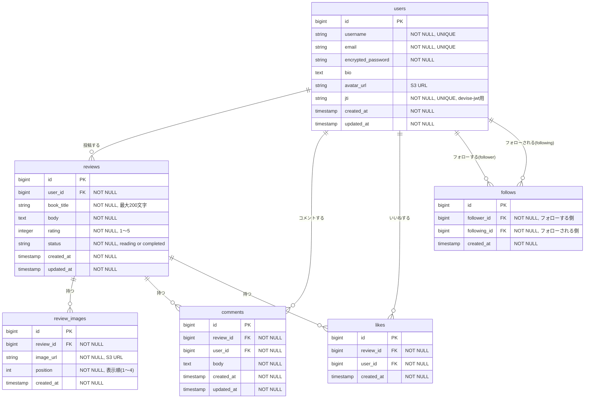

# データベース設計書

## ER図

---

## テーブル定義

### users（ユーザー）

| カラム名 | 型 | 制約 | 説明 |
|----------|-----|------|------|
| id | BIGSERIAL | PK | ユーザーID |
| username | VARCHAR(50) | NOT NULL, UNIQUE | ユーザー名（表示名） |
| email | VARCHAR(255) | NOT NULL, UNIQUE | メールアドレス |
| encrypted_password | VARCHAR(255) | NOT NULL | ハッシュ化パスワード（devise/bcrypt） |
| bio | TEXT | NULL許容 | 自己紹介文（160文字以内） |
| avatar_url | VARCHAR(500) | NULL許容 | アイコン画像のS3 URL |
| jti | VARCHAR(255) | NOT NULL, UNIQUE | JWTトークン識別子（devise-jwt/JTIMatcher用） |
| created_at | TIMESTAMP | NOT NULL | 作成日時 |
| updated_at | TIMESTAMP | NOT NULL | 更新日時 |

**インデックス**: `email`、`username`、`jti` に一意インデックス

---

### reviews（読書レビュー）

| カラム名 | 型 | 制約 | 説明 |
|----------|-----|------|------|
| id | BIGSERIAL | PK | レビューID |
| user_id | BIGINT | NOT NULL, FK(users.id) | 投稿者 |
| book_title | VARCHAR(200) | NOT NULL | 書籍名（最大200文字） |
| body | TEXT | NOT NULL | 感想・レビュー本文 |
| rating | INTEGER | NOT NULL, CHECK(1〜5) | 星評価（1〜5） |
| status | VARCHAR(20) | NOT NULL | 読書ステータス（reading / completed） |
| created_at | TIMESTAMP | NOT NULL | 作成日時 |
| updated_at | TIMESTAMP | NOT NULL | 更新日時 |

**インデックス**: `user_id`、`created_at`（レビュー一覧取得の高速化）

**制約**:
- `rating` に CHECK制約（1以上5以下）
- `status` に CHECK制約（'reading' または 'completed'）

---

### review_images（レビュー写真）

| カラム名 | 型 | 制約 | 説明 |
|----------|-----|------|------|
| id | BIGSERIAL | PK | 写真ID |
| review_id | BIGINT | NOT NULL, FK(reviews.id) | 紐づくレビュー |
| image_url | VARCHAR(500) | NOT NULL | AWS S3の写真URL |
| position | INTEGER | NOT NULL | 表示順（1〜4） |
| created_at | TIMESTAMP | NOT NULL | 作成日時 |

**制約**:
- `(review_id, position)` に UNIQUE 制約
- 1レビューにつき最大4枚（アプリ側でも制御）

---

### comments（コメント）

| カラム名 | 型 | 制約 | 説明 |
|----------|-----|------|------|
| id | BIGSERIAL | PK | コメントID |
| review_id | BIGINT | NOT NULL, FK(reviews.id) | 紐づくレビュー |
| user_id | BIGINT | NOT NULL, FK(users.id) | コメント投稿者 |
| body | TEXT | NOT NULL | コメント本文 |
| created_at | TIMESTAMP | NOT NULL | 作成日時 |
| updated_at | TIMESTAMP | NOT NULL | 更新日時 |

**インデックス**: `review_id`

---

### likes（いいね）

| カラム名 | 型 | 制約 | 説明 |
|----------|-----|------|------|
| id | BIGSERIAL | PK | いいねID |
| review_id | BIGINT | NOT NULL, FK(reviews.id) | 紐づくレビュー |
| user_id | BIGINT | NOT NULL, FK(users.id) | いいねしたユーザー |
| created_at | TIMESTAMP | NOT NULL | 作成日時 |

**制約**: `(review_id, user_id)` に UNIQUE 制約（1ユーザー1レビュー1回のみ）

---

### follows（フォロー）

| カラム名 | 型 | 制約 | 説明 |
|----------|-----|------|------|
| id | BIGSERIAL | PK | フォローID |
| follower_id | BIGINT | NOT NULL, FK(users.id) | フォローする側のユーザーID |
| following_id | BIGINT | NOT NULL, FK(users.id) | フォローされる側のユーザーID |
| created_at | TIMESTAMP | NOT NULL | 作成日時 |

**制約**:
- `(follower_id, following_id)` に UNIQUE 制約（重複フォロー防止）
- `follower_id != following_id` チェック制約（自己フォロー防止）

---

## リレーション一覧

| テーブルA | テーブルB | 関係 | 説明 |
|-----------|-----------|------|------|
| users | reviews | 1 : N | 1ユーザーは複数のレビューを持つ |
| users | comments | 1 : N | 1ユーザーは複数のコメントを持つ |
| users | likes | 1 : N | 1ユーザーは複数のいいねを持つ |
| users | follows | 1 : N | 1ユーザーは複数のフォロー関係を持つ（follower/following双方） |
| reviews | review_images | 1 : N | 1レビューは最大4枚の写真を持つ（S3保存） |
| reviews | comments | 1 : N | 1レビューは複数のコメントを持つ |
| reviews | likes | 1 : N | 1レビューは複数のいいねを持つ |
| users | users | N : M | followsテーブルを介して多対多（フォロー関係） |
